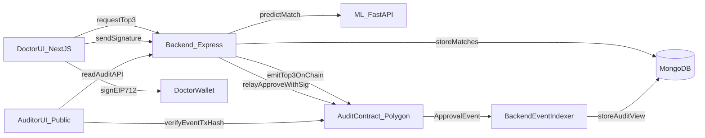

# End-to-end plan: Blockchain audit + EIP-712 doctor approvals

## Goals (what “complete” means)

- **Matching transparency**: every “top 3” recommendation and the final doctor decision is **immutably recorded on-chain** and publicly verifiable.
- **Doctor accountability**: each approval is backed by a **doctor-controlled wallet signature** (EIP-712 typed-data) and is verifiable on-chain.
- **Privacy-safe**: **no PII/medical details** stored on-chain; only hashes/digests and minimal metadata.
- **Operational completeness**: clean dev workflow (local chain + testnet), monitoring/indexing for the auditor UI, and solid docs.

## Current repo reality (integration points)

- **Top-3 generation + DB writes** already exist in backend route `[backend/routes/matchRoutes.js](backend/routes/matchRoutes.js)`:
  - `POST /api/matches/find-top-donors`: computes top-3 and stores `Match` docs with `matchStatus: 'Pending'`.
  - `POST /api/matches/approve`: creates an `Approved` match and marks recipient as `Matched`.
- **ML service call** is via `[backend/utils/mlClient.js](backend/utils/mlClient.js)` → FastAPI `[ML/app/main.py](ML/app/main.py)`.
- **Doctor UI** exists for showing top matches + approving via backend API in `[frontend/components/doctor/top-matches-display.tsx](frontend/components/doctor/top-matches-display.tsx)`.
- **Auditor UI** exists but is currently mock/static in `[frontend/components/dashboard/auditor-view.tsx](frontend/components/dashboard/auditor-view.tsx)`.

## Target architecture (minimal but robust)

### What goes on-chain vs off-chain

- **Off-chain (MongoDB)**: full donor/recipient records, match inputs, full XAI payloads, internal IDs.
- **On-chain (Polygon testnet)**: append-only audit events containing:
  - `recipientHash` (salted hash), `donorHashes[3]` (salted)
  - `scores[3]`, `modelVersion`, `xaiDigest` (hash of explanation JSON), `backendBatchId` (bytes32)
  - `doctorAddress`, `selectedDonorHash`, `approvalDigest`, `sig`-verified approval

### Identity + permissions

- **Doctor identity**: wallet address.
- **Doctor credential token (makes it “more interesting”)**: mint a **non-transferable Doctor Credential (SBT)** to doctor wallets.
  - Contract checks doctor holds credential before approval.
  - Admin/hospital mints credentials (one-time) to onboard doctors.

### Approval flow (EIP-712)

- Doctor signs typed data off-chain (EIP-712): `Approve(recipientHash, selectedDonorHash, backendBatchId, nonce, deadline, approvalDigest)`.
- Backend relays a transaction `approveWithSig(...)` to the audit contract (gas paid by relayer), and the contract verifies `ecrecover`.
- This gives: **doctor-controlled signature** + **single public on-chain record** even though the backend submits.

## Data flow (high level)

## Implementation phases

### Phase 0 — Finalize “audit schema” and privacy model

- Define a stable **Audit Payload Spec** (JSON) for:
  - `Top3ProposedPayload`
  - `ApprovalPayload`
- Choose hashing rules:
  - `recipientHash = keccak256(salt || patientId)`
  - `donorHash = keccak256(salt || donorId)`
  - `xaiDigest = keccak256(canonicalJson(shap/explanations))`
- Add a versioned `modelVersion` string (e.g. git commit hash of ML model or a manual semantic version).

### Phase 1 — Add blockchain project + contracts

Create new folder `[blockchain/](blockchain/)` using Hardhat:

- **Contracts**:
  - `DoctorCredentialSBT.sol` (admin mint, non-transferable)
  - `OrganMatchAudit.sol` (stores/validates events; emits logs)
- **Key methods/events** (suggested):
  - `event Top3Proposed(bytes32 backendBatchId, bytes32 recipientHash, bytes32[3] donorHashes, uint16[3] scores, bytes32 xaiDigest, string modelVersion, uint64 timestamp)`
  - `event MatchApproved(bytes32 backendBatchId, bytes32 recipientHash, bytes32 selectedDonorHash, address doctor, bytes32 approvalDigest, uint64 timestamp)`
  - `function proposeTop3(...)` restricted to backend/relayer role
  - `function approveWithSig(...)` verifies EIP-712 signature + SBT ownership
- Add Hardhat scripts for deploy to:
  - local node
  - Polygon testnet

### Phase 2 — Backend: write-to-chain + event indexing

In `[backend/](backend/)`:

- Add `blockchain/` util module (ethers.js) for:
  - contract instantiation
  - `proposeTop3OnChain(payload)`
  - `approveWithSigOnChain(payload, signature)`
- Extend existing routes:
  - `[backend/routes/matchRoutes.js](backend/routes/matchRoutes.js)`
    - after top-3 DB save, call `proposeTop3OnChain` and store returned `txHash` + `backendBatchId` into Mongo (new fields in `Match` or separate `AuditLog` model).
    - in approval route, require `doctorAddress` + `signature` + `deadline`, relay `approveWithSigOnChain`, store `txHash`.
- Add a **blockchain event indexer** (simple polling or websocket provider):
  - listens to `Top3Proposed` + `MatchApproved`
  - writes a denormalized `AuditLog` collection for fast auditor queries.
- Add audit APIs:
  - `GET /api/audit/top3?recipientHash=...`
  - `GET /api/audit/events?limit=...`
  - `GET /api/audit/proof?backendBatchId=...` (returns recomputed hashes + chain tx/event to verify)

### Phase 3 — Frontend: wallet signing + auditor page becomes real

In `[frontend/](frontend/)`:

- Add wallet connectivity (wagmi + viem or ethers) and a small `WalletProvider`.
- Update `[frontend/components/doctor/top-matches-display.tsx](frontend/components/doctor/top-matches-display.tsx)`:
  - require wallet connect
  - when “Approve Match” is clicked:
    - fetch typed-data payload (domain + nonce) from backend
    - `signTypedData` (EIP-712)
    - send signature to backend approval endpoint
    - display tx hash + status
- Replace mock auditor data in `[frontend/components/dashboard/auditor-view.tsx](frontend/components/dashboard/auditor-view.tsx)`:
  - call `GET /api/audit/events`
  - show real timeline entries with `txHash`, block number, timestamp
  - add “Verify” action: re-compute proof from backend and compare to on-chain event fields

### Phase 4 — Token/credential flow (Doctor SBT)

- Add admin UI (or backend script) to mint doctor credentials:
  - simplest: backend script `node scripts/mintDoctor.js --address 0x...`
  - optional: admin page in frontend
- Enforce on-chain: only credential holders can approve.

### Phase 5 — Quality: tests, security, and documentation

- Smart contract unit tests (Hardhat):
  - EIP-712 signature verification
  - SBT gating
  - replay protection (nonces)
- Backend integration tests:
  - local chain + propose + approve path
- Docs update:
  - `[README.md](README.md)` add full “Run locally” steps for 3 services + chain
  - environment variables list for backend + frontend + blockchain

## Non-negotiable guardrails (so it stays credible)

- **Never store** raw patient/donor details or SHAP values on-chain.
- Use **salted hashing** so public observers can’t reverse IDs.
- Add **nonces + deadlines** for signatures to prevent replay.
- Treat blockchain as an **append-only audit log**; Mongo remains the operational store.

## Deliverables checklist

- `blockchain/` Hardhat project, deployed contract addresses
- On-chain `Top3Proposed` + `MatchApproved` events for every run
- Doctor approvals require wallet EIP-712 signature
- Auditor dashboard shows real chain-backed history + verification view
- Updated README with end-to-end run/deploy instructions

